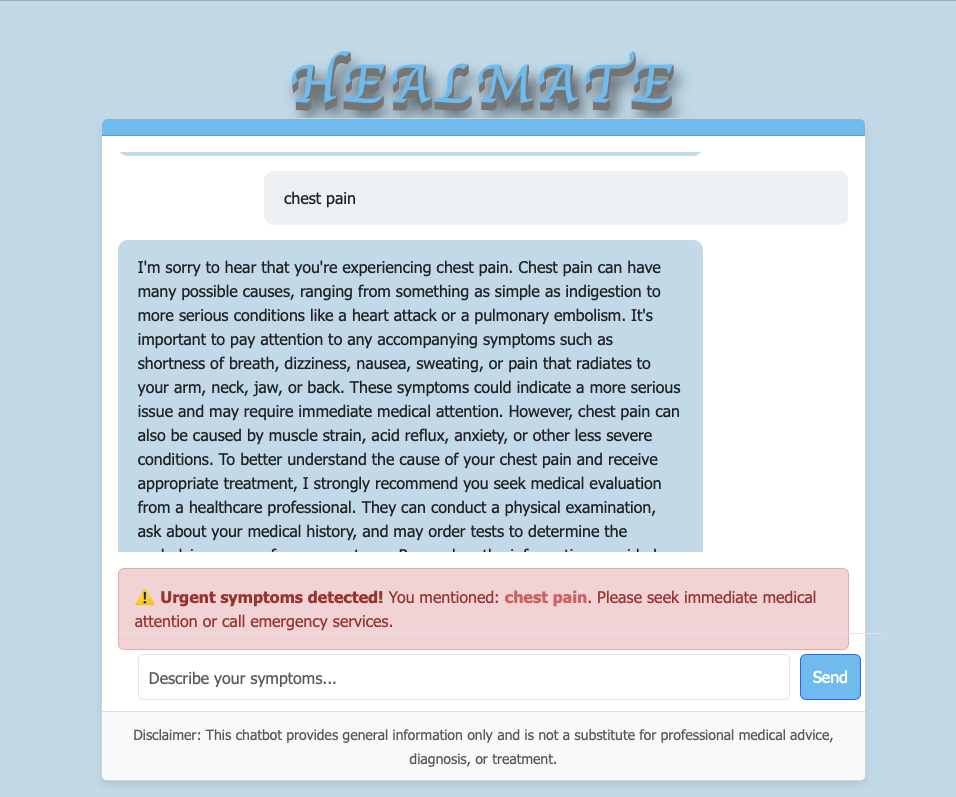

# 🩺 HEALMATE


A modern medical chatbot for symptom analysis and urgency triage using OpenAI's GPT-3.5 Turbo model.

## Features

- **Symptom Analysis**: Collects and analyzes user-reported symptoms using AI
- **Urgency Triage**: Flags high-risk symptoms (e.g., chest pain, difficulty breathing, severe bleeding)
- **Medical Knowledge**: Leverages OpenAI's GPT-3.5 Turbo model for evidence-based recommendations
- **Beautiful Interface**: Stylish, responsive chat interface with 3D title effects
- **Disclaimer**: Clear medical disclaimer to ensure responsible use


## Installation

### Prerequisites

- Python (v3.8 or higher)
- OpenAI API key

### Setup

1. Clone the repository:

```bash
git clone https://github.com/yourusername/healmate.git
cd healmate
```

2. Create and activate a virtual environment:

```bash
python -m venv venv
source venv/bin/activate  # On Windows: venv\Scripts\activate
```

3. Install dependencies:

```bash
pip install -r requirements.txt
```

4. Create a `.env` file in the root directory and add your OpenAI API key:

```
OPENAI_API_KEY=your_openai_api_key_here
PORT=5001
```

## Usage

### Development

Run the Flask development server:

```bash
python app.py
```

Open your browser and navigate to `http://localhost:5001`.

### Production

For production deployment using Gunicorn:

```bash
gunicorn app:app
```

## How it Works

1. **Frontend Interface**: HTML/CSS/JavaScript provide a responsive chat interface
2. **Backend Processing**: Flask backend handles API requests and serves static files
3. **Symptom Analysis**: User input is analyzed for urgent symptoms using a predefined list
4. **AI Integration**: OpenAI's GPT-3.5 Turbo model provides informed responses about symptoms
5. **Warning System**: Urgent symptoms trigger visible warnings to seek immediate medical help

## Project Structure

```
├── app.py              # Flask server and API endpoints
├── index.html          # Main HTML interface
├── styles.css          # CSS styling
├── app.js              # Frontend JavaScript
├── .env                # Environment variables
├── requirements.txt    # Python dependencies
└── README.md           # Project documentation
```

## Deployment Options

### Heroku

1. Sign up for a [Heroku](https://www.heroku.com/) account
2. Install the Heroku CLI and login
3. Create a new Heroku app and set up environment variables:

```bash
heroku create healmate-chatbot
heroku config:set OPENAI_API_KEY=your_openai_api_key_here
git push heroku main
```

### Render

1. Sign up for a [Render](https://render.com/) account
2. Create a new Web Service
3. Connect your GitHub repository
4. Set the build command to `pip install -r requirements.txt`
5. Set the start command to `gunicorn app:app`
6. Add your environment variables in the Render dashboard

## Security Considerations

- The OpenAI API key is stored server-side in environment variables
- The application includes proper error handling and sanitized inputs
- A clear medical disclaimer helps prevent misuse or over-reliance on the tool
- Debug logs show only partial API keys to maintain security

## License

This project is licensed under the MIT License - see the LICENSE file for details.

## Disclaimer

This application is for educational purposes only and is not a substitute for professional medical advice, diagnosis, or treatment. Always seek the advice of your physician or other qualified health provider with any questions you may have regarding a medical condition. 
